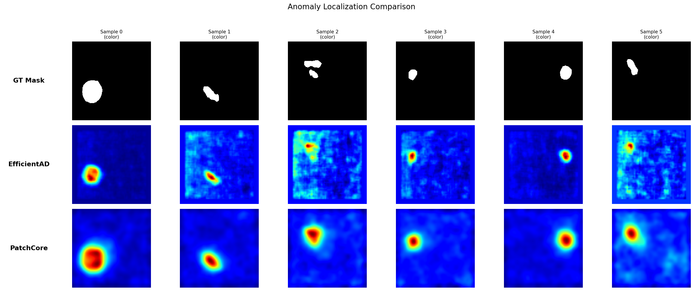
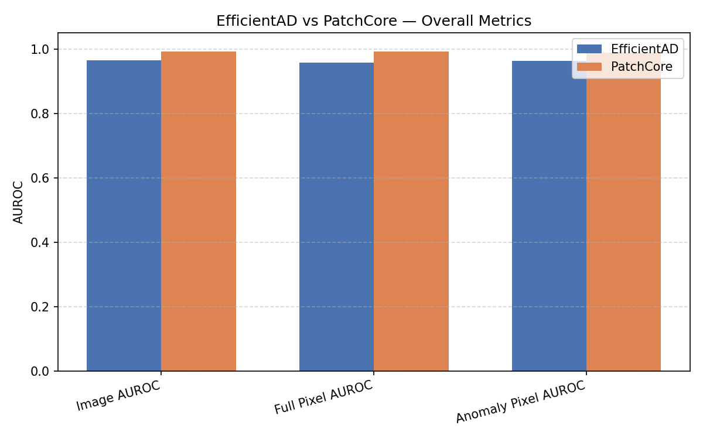
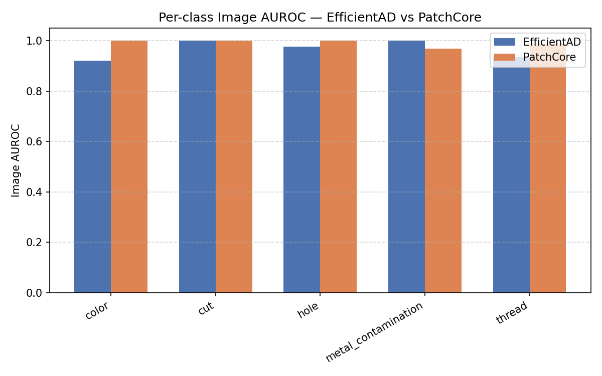

## Anomaly Detection: EfficientAD vs PatchCore

### Problem Interpretation

The goal is to detect and localize anomalies in industrial surface images (e.g., MVTec carpet category). In practical manufacturing settings, we often have access only to normal (good) samples during training, since defective products are rare or costly to produce. The model must therefore learn the distribution of normal images and detect deviations.

---

### Methodology

Two established approaches were implemented and compared:

**PatchCore** 
treats anomaly detection as a nearest-neighbour problem. During training, patch-level features are extracted from a pretrained ResNet backbone and stored in a compressed memory bank (coreset). At inference, each patch is compared against the bank via FAISS search — high distance indicates anomalous regions. PatchCore represents the **accuracy-optimised** approach.  
[Paper: PatchCore](https://arxiv.org/abs/2106.08265)

**EfficientAD** 
uses a teacher-student architecture with a lightweight PDN (Patch Description Network). The student is trained to mimic the teacher on normal images. At inference, disagreement between teacher and student (ST map) and between the autoencoder and student (AE map) jointly produce the anomaly score. EfficientAD represents the **inference-optimised** approach.  
[Paper: EfficientAD](https://arxiv.org/abs/2303.14535)

---

### Key Design Decisions

#### Data Engineering

- **Validation split only for EfficientAD**  
  A small validation set is used only by EfficientAD to calibrate anomaly score thresholds.  

- **Augmentation only for EfficientAD**  
  EfficientAD uses color jitter during training. Each image produces two versions:
  - `image_st` — clean image for teacher–student comparison  
  - `image_ae` — color-jittered image for the autoencoder  

  PatchCore does **not use augmentation**, since its memory bank is built from raw feature embeddings.

---

#### Model Trade-offs

PatchCore and EfficientAD are intentionally complementary:

| | PatchCore | EfficientAD |
|---|---|---|
| Training | Simple — no training, just feature extraction | Complex — three losses, frozen teacher, careful normalization |
| Memory | Heavy — coreset stored as FAISS index | Light — only model weights |
| Inference (GPU) | ~381ms — dominated by FAISS search | ~15ms — three small CNNs |


PatchCore is the better detector out of the box; EfficientAD is the practical choice when latency or memory is constrained.

--------
#### PatchCore

- **Multi-scale feature extraction**  
  Features are extracted from **WideResNet50 `layer2` and `layer3`**:
  - `layer2` captures fine texture details  
  - `layer3` captures higher-level semantic context  

- **Coreset subsampling**  
  Storing every patch feature would require a huge memory bank.  
  Instead, PatchCore selects a representative subset of features (a coreset) that still covers the feature space well.

- **FAISS for fast search**  
  The coreset is stored in a **FAISS index** to enable fast nearest-neighbour search during inference.  

---

#### EfficientAD

- **Frozen teacher netowrk**  
  A pretrained **teacher network** remains frozen, while a **student network** is trained to mimic its outputs using normal images.


---

### Assumptions

- **Localized anomalies**  
  We assume the **maximum pixel anomaly score** can be used as the image-level anomaly score, since the most extreme local deviation is likely to represent the defect.

- **Representative memory bank (PatchCore)**  
  We assume that the **coreset memory bank** constructed during training is a sufficiently representative sample of the normal feature distribution.  


- **Sufficient feature layers (PatchCore)**  
  For PatchCore, we assume that features from **`layer2` and `layer3` of WideResNet50** provide enough information for anomaly detection.  

---

### Evaluation



Both models are evaluated on three metrics:

| Metric               | EfficientAD | PatchCore  |
|----------------------|-------------|------------|
| Image AUROC          | 0.9647      | **0.9916** |
| Full Pixel AUROC     | 0.9570      | **0.9912** |
| Anomaly Pixel AUROC  | 0.9620      | **0.9887** |


Per-class image AUROC:

| Class                | EfficientAD | PatchCore  |
|----------------------|-------------|------------|
| color                | 0.9211      | **1.0000** |
| cut                  | **1.0000**  | **1.0000** |
| hole                 | 0.9769      | **1.0000** |
| metal_contamination  | **1.0000**  | 0.9685     |
| thread               | 0.9342      | **0.9887** |

PatchCore outperforms EfficientAD on nearly all metrics. The exception is `metal_contamination`, where EfficientAD achieves perfect classification (1.0 vs 0.9685).




Benchmarked over 100 reps (10 warmup discarded). CUDA timings use `torch.cuda.synchronize()` to avoid measuring async launches.

| Model | Mean (ms) | Min (ms) | Max (ms) |
|---|---|---|---|
| EfficientAD (CUDA) | **14.6** | 14.53 | 15.0 |
| PatchCore (CUDA) | 380.84 | 380.30 | 381.71 |
| EfficientAD (CPU) | 492.62 | 474.86 | 495.8 |
| PatchCore (CPU) | 614.25 | 586.37 | 634.12 |

EfficientAD is **~26× faster on GPU** — three small PDN/AE networks vs. WideResNet50 + FAISS search over a large memory bank. The gap closes on CPU (~1.25×).


Experiments were run on a NVIDIA A100-SXM4-40GB GPU (CUDA 12.2, Driver 535.288.01) on the CSC Mahti supercomputer.

---

### Observed Limitations
**EfficientAD**
- Misses `color` and `thread` defects more often than PatchCore 

- CPU inference is impractically slow at ~493ms/image for a production setting

**PatchCore**
- FAISS search over the full memory bank dominates inference time — ~381ms/image on GPU, ~614ms on CPU, making real-time use infeasible without significant coreset reduction
- Memory footprint grows with training set size; the coreset ratio is a hard trade-off between speed and accuracy
- No GPU acceleration benefit on CPU — the FAISS search parallelism advantage disappears, and the gap vs. EfficientAD shrinks to ~1.25×

---

### What Would Be Improved With More Time

- **Hyperparameter tuning** — coreset ratio, number of PDN training steps, learning rate schedule, and color jitter strength were set from paper defaults; a structured search (e.g. grid or Bayesian) could meaningfully improve both accuracy and speed.

- **Ablation: layer selection for PatchCore** — `layer2`+`layer3` was chosen following the original paper; ablating single-layer vs. deeper layers (`layer4`) would clarify how much the multi-scale fusion actually contributes on carpet texture.

- **Approximate FAISS index** A better alternative to decrease latency  while retaining most accuracy — currently the exact flat index is the primary bottleneck.

- **EfficientAD training schedule** — 10,000 steps may underfit on carpet; ablating step count and adding learning rate warmup could close the accuracy gap with PatchCore.

- **Augmentation ablation for EfficientAD** — color jitter appears to hurt `color` defect detection; testing without jitter, or restricting it to brightness/contrast only, would isolate the effect.


### Reproduction

#### 1. Environment Setup

```bash
conda env create -f env.yml
conda activate texture_analysis
```

#### 2. Train

Open and run `train.ipynb` — trains EfficientAD and builds the PatchCore memory bank.

#### 3. Pretrained Weights & Index

To skip training, weights and embeddings are provided as follows:

```
anomaly-detection/
├── models/
│   ├── teacher.pth
│   ├── student_final.pth
│   ├── autoencoder_final.pth
│   └── stats.pth
└── results/
    └── patchcore/
        └── memory_bank.faiss
```
#### 4. Evaluate

```bash
python src/eval.py
```

Outputs CSVs, metric plots, and anomaly map visualizations to `results/`.

```bash
python src/benchmark.py
```

Runs 100-rep inference timing (10 warmup) on all available devices and saves `results/benchmark_results.csv`.

### Presentation


 [Problem and chosen approach](anomaly-detection-ppt.pdf)